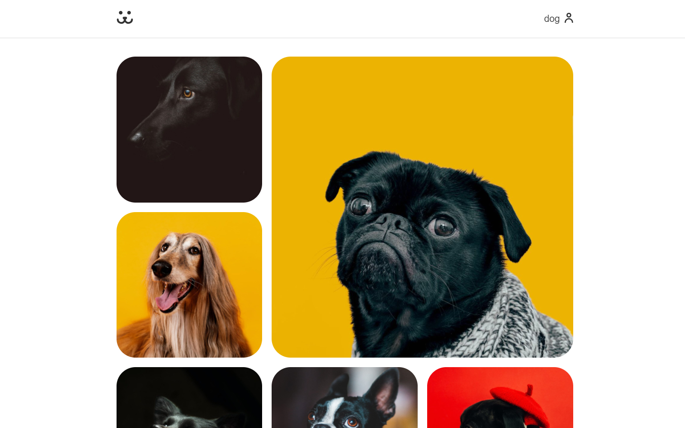

<!-- PROJECT LOGO -->
<br />
<p align="center">
  

  <h3 align="center">Dogs</h3>
</p>

<details open="open">
  <summary>Table of Contents</summary>
  <ol>
    <li>
      <a href="#about-the-project">About The Project</a>
      <ul>
        <li><a href="#developed-with">Developed With</a></li>
      </ul>
    </li>
    <li>
      <a href="#getting-started">Getting Started</a>
      <ul>
        <li><a href="#requirements">requirements</a></li>
        <li><a href="#installing">Installation</a></li>
      </ul>
    </li>
    <li><a href="#license">License</a></li>
  </ol>
</details>

## About The Project



This project was developed during a course, it's basically a instagram clone, but for dogs. In this project i've learned a lot of things like: how to create and use react components, react-router, context api, Hooks, and more.

### have a look on the website here: [dogs](https://dogs-social-media.netlify.app)

### Developed With

- [Javascript](https://jquery.com)
- [CSS3](https://developer.mozilla.org/en-US/docs/Web/CSS)
- [React js](https://reactjs.org/)

## 💻 Getting Started

<hr>

### Requirements

To run this project You need to install both Node.js and Yarn to run this project.

- yarn
  ```sh
  npm install npm@latest -g
  ```

#### installing

1. Clone the repo
   ```sh
   git clone https://github.com/Vitor-Silva-developer/Dogs.git
   ```
2. Install the dependencies
   ```sh
   yarn
   ```
3. run the app
   ```sh
   yarn start
   ```
   the app will be available to access on your browser at http://localhost:3000

## License

Distributed under the MIT License. See `LICENSE` for more information.
